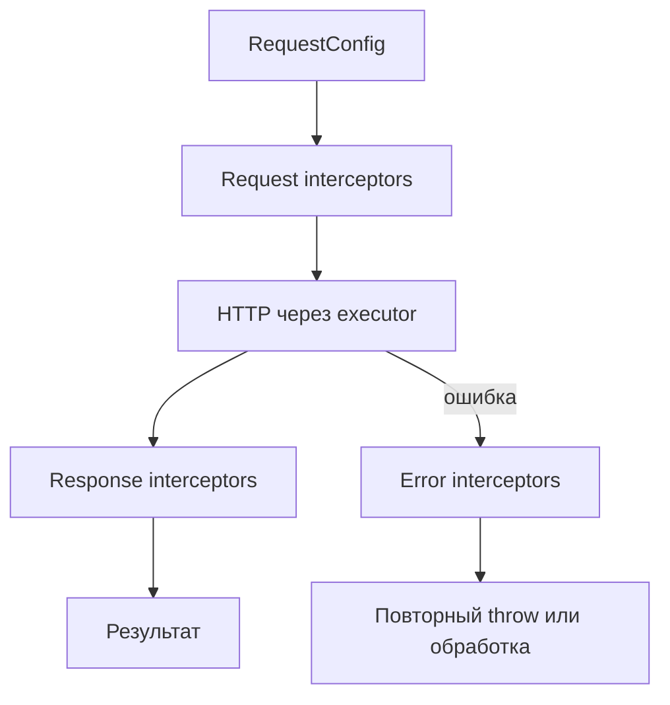

# Руководство по миграции: 1.0.0 -> 2.1.0

Этот документ описывает переход с `1.0.0` на `2.1.0` на основе diff изменений в репозитории.

## Область миграции

Переход включает:
- изменения валидации CLI и формата конфигурации;
- изменения runtime/core архитектуры (executor/interceptors);
- изменения параметров генерации схем;
- обновления системы версионирования и миграции конфигов.

## Ломающие изменения (Breaking Changes)

### 1) Изменился параметр генерации validation-схем

`includeSchemasFiles` удален и заменен на `validationLibrary`.

Было:
```json
{
  "includeSchemasFiles": true
}
```

Стало:
```json
{
  "validationLibrary": "zod"
}
```

Поддерживаемые значения:
- `none` (по умолчанию)
- `zod`
- `joi`
- `yup`
- `jsonschema`

### 2) Добавлен контроль поведения пустых схем

Новый параметр: `emptySchemaStrategy`

Допустимые значения:
- `keep` (по умолчанию)
- `semantic`
- `skip`

Пример:
```json
{
  "validationLibrary": "zod",
  "emptySchemaStrategy": "semantic"
}
```

### 3) Изменилась архитектура runtime/core

Генерация сервисов перешла на модель `RequestExecutor`.

**Было:** сервисы часто вызывали общий `request()` напрямую.

**Стало:** каждый сгенерированный сервис получает `RequestExecutor` в конструкторе и вызывает `executor.request()` или `executor.requestRaw()`.

#### Контракт RequestExecutor

- `request<T>(config, options?)` — возвращает распарсенное тело ответа.
- `requestRaw<T>(config, options?)` — возвращает `ApiResult<T>` (`url`, `ok`, `status`, `statusText`, `body`).
- `RequestConfig` описывает method, path, headers, query, body, media types и опционально `responseType: 'blob'`.

#### Кастомный HTTP-слой

- `request` в конфиге по-прежнему указывает на транспортный модуль (legacy-сигнатура `ApiRequestOptions`); при генерации копируется в `core/request.ts`.
- `customExecutorPath` указывает на модуль с экспортом `createExecutorAdapter`; при генерации копируется в `core/executor/createExecutorAdapter.ts` (не импортируется в runtime).
- `createLegacyRequestAdapter(openApiConfig, mapOptions?)` — сгенерированный helper для проектов с legacy custom `request()` без полного переписывания на `RequestExecutor`. Используйте через `createClient({ executorFactory: ({ openApiConfig }) => createLegacyRequestAdapter(openApiConfig) })`.
- Если кастомный транспорт экспортирует `requestRaw`, legacy adapter делегирует в него; иначе `requestRaw` синтезирует минимальный `ApiResult` из `request()` (status 200).

#### Цепочка interceptors



Порядок: request interceptors → HTTP → response interceptors; при ошибке сначала error interceptors, затем исключение.

Error interceptors могут вернуть `RequestRecovery(value)` для восстановления после ошибки; восстановленное значение проходит через response interceptors.

`createClient` всегда оборачивает executor в `withInterceptors` с дефолтным `apiErrorInterceptor` (с `2.1.0`).

Транспортный `ApiError` (из `catchErrors`) теперь хранит slim `request` config, а payload ответа — в `body`, вместо полного `ApiRequestOptions` в `request`.

При включённом `useCancelableRequest` методы `RequestExecutor.request` / `requestRaw` возвращают `CancelablePromise`.

Влияние:
- если у вас была кастомная интеграция со старым request-потоком, ее нужно адаптировать под executor-подход;
- в generated core появились/обновились артефакты для executor/interceptors (`core/executor`, interceptor-файлы).

### 4) Унификация схемы конфигурации

Старые семейства конфигов (`OPTIONS`, `MULTI_OPTIONS`) мигрируют в унифицированный формат (`UNIFIED_OPTIONS`).

Влияние:
- старые конфиги должны мигрироваться автоматически;
- если есть внешние инструменты, читающие старую структуру конфига, их нужно обновить.

### 5) Удаленные/устаревшие части

- удален `includeSchemasFiles`;
- legacy-валидация CLI заменена на Zod;
- часть устаревших внутренних helper-утилит и legacy request executor удалена/переработана.

### 6) Ужесточено поведение direct-валидации `generate` в `2.0.0`

Для direct-режима CLI (`--input` + `--output`):
- валидация теперь выполняется через актуальную Zod-схему (`flatOptionsSchema`);
- генерация запускается только при успешной валидации.

Если direct-опции невалидны/пустые и config-файл отсутствует, CLI теперь возвращает более явную и прикладную ошибку.

### 7) Унифицированный diff-отчёт (`2.1.0`)

#### Что изменилось

- Вывод `analyze-diff` по умолчанию теперь `schemaVersion: "2.0.0"` с вложенными блоками `semantic` и `structural`.
- `generate --useHistory` снова работает; `loadDiffReport` автоматически адаптирует отчёты 2.0.0, 1.1.0 и legacy flat.

#### Ломающее изменение для потребителей отчёта

| Было (1.1.0) | Стало (2.0.0) |
|---|---|
| `report.changes` | `report.semantic.changes` |
| `report.summary` | `report.semantic.summary` |
| `report.governance` | `report.semantic.governance` |
| `report.recommendation` | `report.semantic.recommendation` |
| `report.miracles` | `report.structural.miracles` |

Пример (фрагмент):
```json
{
  "schemaVersion": "2.0.0",
  "timestamp": "2026-06-06T12:00:00.000Z",
  "metadata": {
    "base": "compare-with:./openapi/previous.yaml",
    "target": "./openapi/current.yaml",
    "baseHash": "...",
    "targetHash": "..."
  },
  "semantic": {
    "changes": [],
    "summary": { "breaking": 0, "nonBreaking": 0, "informational": 0 },
    "governance": {},
    "recommendation": {}
  },
  "structural": {
    "diff": { "breaking": [], "warnings": [], "info": [], "all": [] },
    "miracles": [],
    "stats": {}
  }
}
```

#### Рекомендуемые шаги миграции

1. Перезапустите `analyze-diff` перед включением или регенерацией с `useHistory`.
2. Обновите CI-скрипты и дашборды, парсящие `openapi-diff-report.json`, на чтение `report.semantic.*`.
3. Для structural-инструментов используйте `report.structural.diff.all` и `report.structural.miracles` напрямую.
4. Перегенерируйте клиенты при `modelsMode: "classes"` или схемах с дублирующимися именами (изменилась нумерация алиасов).
5. Подтверждайте miracles в `report.structural.miracles` — workflow не изменился, изменилось только расположение.

#### Замечания по совместимости

- Изменения CLI-флагов для `generate` и `analyze-diff` не требуются.
- Старые отчёты 1.1.0 по-прежнему загружаются через адаптер; для полной `structural`-точности рекомендуется перегенерировать отчёт.
- Workflow подтверждения miracles не изменился: установите `"status": "confirmed"` перед генерацией.

### 8) Дефолтные пути CLI-отчётов (`2.1.0`)

**Breaking change:** если явные пути не заданы, CLI теперь пишет отчёты в `./.openapi-codegen-reports/` вместо корня проекта.

| Отчёт | Новый путь по умолчанию |
|-------|-------------------------|
| Strict OpenAPI diagnostics (`--report-file`) | `./.openapi-codegen-reports/openapi-report.json` |
| Spec analysis (`specAnalysis.reportPath`) | `./.openapi-codegen-reports/anomaly-report.json` |
| `analyze-diff` (`--output-report`) | `./.openapi-codegen-reports/openapi-diff-report.json` |
| `analyze-usage` (`--output`) | `./.openapi-codegen-reports/openapi-usage-report.json` |
| Сводка batch ESLint fix | `./.openapi-codegen-reports/eslint-fix-report.json` |
| `generate --diffReport` / config `diffReport` | `./.openapi-codegen-reports/openapi-diff-report.json` |

Явные пути в флагах и конфиге не меняются.

**Рекомендуемые шаги:**

1. Обновите CI-скрипты и сбор артефактов, ожидающие `openapi-*.json` в корне проекта.
2. Добавьте `.openapi-codegen-reports/` и `.openapi-codegen-store/` в `.gitignore` (оба каталога есть в шаблоне репозитория).
3. Либо зафиксируйте явные пути в конфиге/CLI, если нужен прежний layout.

### 9) Набор возможностей Marauder (`2.1.0`)

Preview-возможности «Marauder» поставляются в **`2.1.0`**. Для ключей конфигурации они **аддитивные и опциональные**; всё выключено по умолчанию.

#### Схема конфигурации (авто-миграция)

Конфиги используют актуальную унифицированную схему. Выполните:

```bash
openapi-codegen-cli update-config --openapi-config ./openapi.config.json
```

Новые опциональные блоки конфигурации (показаны значения по умолчанию):

```json
{
  "autoSelect": {
    "enabled": false,
    "strict": false,
    "preferSmallBundles": false,
    "preferStandards": false
  },
  "specAnalysis": {
    "enabled": false,
    "severity": "medium",
    "reportFormat": "json",
    "reportPath": "./.openapi-codegen-reports/anomaly-report.json",
    "failOnHigh": false,
    "crossSpec": true,
    "maxNestingDepth": 5
  }
}
```

#### Анализ спецификации (`specAnalysis`)

`specAnalysis` заменяет устаревший алиас `anomalyDetection`. Оба ключа принимаются в конфиге для обратной совместимости; в новых конфигах используйте `specAnalysis`.

- CLI: `--spec-analysis` с dot-notation (например `--spec-analysis.fail-on-high`, `--spec-analysis.report-path`); `--anomaly-detection` — устаревший alias
- Поддерживаются inline JSON/boolean: `--spec-analysis=true`, `--auto-select='{"strict":true}'`
- Конфиг: root и per-item (`items[]`) overrides; multi-item конфиги объединяются через `mergeSpecAnalysisConfigAcrossItems`
- Выполняется во время `generate`, когда включено; пишет отчёт качества в `reportPath`
- При `cache: true` или `specAnalysis.enabled` unified-отчёт генерации пишется в `{output}/reports/latest.json` (или `<cachePath>/reports/latest.json` при reuse)
- `failOnHigh` / legacy `failOnAnomalies` проверяется только после завершения cross-spec анализа (`finalizeSpecAnalysis`)

#### Стратегии кэша (`cacheStrategy`)

При `cache: true` выберите режим инкрементальной генерации:

| Стратегия | Поведение |
|-----------|-----------|
| `entity` | Per-output `.openapi-codegen-cache.json`; пропуск полной регенерации при неизменных входах (`update-config` может сохранить это для старых конфигов) |
| `reuse` | Глобальный `.openapi-codegen-store` с общими артефактами model/schema, копируемыми в output (актуальный preview-дефолт) |
| `content` | Без entity/reuse store; только `writeFileIfChanged` (всегда активен, логируется при `cacheDebug: true`) |

CLI `--cacheStrategy` опционален; не указывайте флаг, чтобы сохранить значение из `openapi.config.json`.

#### Reuse store (`cacheStrategy: "reuse"`)

При `cache: true` и `cacheStrategy: "reuse"`:

- Канонические артефакты model/schema хранятся в `.openapi-codegen-store` (или `cachePath`)
- Файлы в output получают полную копию содержимого артефакта (байт-в-байт из store при cache hit)
- Пути артефактов включают суффикс `optionsSliceHash`, чтобы одно имя модели с разным `validationLibrary`/префиксами получало разные файлы в store
- Одинаковое имя модели с другой схемой вызывает `ReuseConflictError` и прерывает генерацию (по умолчанию `reuseOnConflict: "fail"`)
- Установите `reuseOnConflict: "namespace"`, чтобы хранить конфликтующие схемы в spec-scoped путях артефактов вместо ошибки

Пример:

```json
{
  "cache": true,
  "cacheStrategy": "reuse",
  "cachePath": ".openapi-codegen-store",
  "reuseOnConflict": "namespace",
  "items": [
    { "input": "./specs/a.yaml", "output": "./generated/a" },
    { "input": "./specs/b.yaml", "output": "./generated/b" }
  ]
}
```

CLI: `--reuseOnConflict namespace` (опционально; без флага сохраняется значение из конфига).

Минимальный пример (политика конфликтов по умолчанию):

```json
{
  "cache": true,
  "cacheStrategy": "reuse",
  "cachePath": ".openapi-codegen-store",
  "items": [
    { "input": "./specs/a.yaml", "output": "./generated/a" },
    { "input": "./specs/b.yaml", "output": "./generated/b" }
  ]
}
```

#### Auto-select (`autoSelect`)

- CLI: `--auto-select` (dot-notation: `--auto-select.strict`, `--auto-select.prefer-standards`)
- Конфиг: только root (копируется на все items в runtime)
- Для multi-item без root `output` анализ использует директории первого item; при разных output каждый уникальный output проверяется отдельно — при расхождении рекомендаций применяются per-item overrides и пишется warning

#### Governance gate при generate

- CLI: `--fail-on-governance-errors` (требует `--strict-openapi`)
- Конфиг: root `failOnGovernanceErrors`
- Прерывает генерацию, если strict diagnostics governance summary содержит errors

#### Улучшения analyze-usage

- `--diff-report` — путь к JSON `analyze-diff`; проверяет RENAME miracles против импортов потребителя
- API-импорты резолвятся path-based от `--sourcePath` (TypeScript module resolution, aliases поддерживаются)
- Сканируется только `{projectPath}/src/**/*.{ts,tsx}`

Пример CI-цепочки:

```bash
openapi analyze-diff --input ./openapi/current.yaml --compare-with ./openapi/previous.yaml --ci
openapi generate --openapi-config ./openapi.config.json --strict-openapi --fail-on-governance-errors
openapi analyze-usage --sourcePath ./generated/index.ts --projectPath . --check --diff-report ./.openapi-codegen-reports/openapi-diff-report.json
```

#### Устаревшие алиасы

- `anomalyDetection` → используйте `specAnalysis` (legacy-конфиги по-прежнему парсятся)
- Удалено в этом refocus: CLI/API `heal`, `migrate`, `swarm`, `anomalyExploitation`
  - Примечание: с `2.1.0` `generate --swarm` / конфиг `swarm` пишет только Swarm-**манифест**; top-level команда `swarm` не возвращается (см. §10)

#### Ограничения preview

- `--auto-select` применяется при генерации из `openapi.config.json` или merged multi-item конфигов
- `specAnalysis` сообщает о проблемах качества; спеки автоматически не исправляет
- Reuse store требует `modelsMode: "interfaces"` (по умолчанию); режим classes отключает reuse артефактов

### 10) Marauder Phase 2 (`2.1.0`)

Phase 2 добавляет дополнительные **opt-in** шаги Marauder в `generate`. Новые ключи конфигурации аддитивные; существующие конфиги остаются валидными. Всё по-прежнему выключено по умолчанию.

Top-level CLI-команды `heal`, `migrate` и `swarm` по-прежнему **удалены** (см. §9). Phase 2 их **не возвращает**.

Пример конфига: `example/openapi.marauder.config.json`.

#### Новые опциональные ключи конфигурации (показаны значения по умолчанию)

```json
{
  "workspaceReport": {
    "enabled": false,
    "path": "./workspace-report",
    "format": "json"
  },
  "trafficSplitter": {
    "enabled": false,
    "strategy": "weighted"
  },
  "swarm": {
    "enabled": false,
    "output": "./swarm-manifest.json"
  },
  "preAnalyze": false,
  "reuseMode": "copy"
}
```

Только root (не наследуются в `items[]`). CLI-флаги зеркалят конфиг: `--workspace-report`, `--traffic-splitter`, `--swarm`, `--pre-analyze`, `--reuse-mode <copy|auto-group>` (для object-блоков поддерживается dot-notation).

#### Workspace report (`workspaceReport` / `--workspace-report`)

- После генерации (+ после `finalizeSpecAnalysis`, если применимо) пишет `{path}.json` и/или `{path}.md` (`format`: `json` | `markdown` | `both`)
- Агрегирует per-spec статистику и cross-spec находки (манифест ReuseStore при включённом reuse)
- Ошибки записи логируются как warn; генерация не прерывается

#### Traffic splitter helper (`trafficSplitter` / `--traffic-splitter`)

- Пишет автономный `TrafficSplitter.ts` в output первого item (без внешних import)
- Только helper — **не** переключает live traffic и не деплоит клиенты
- При multi-item логируется предупреждение, файл всё равно генерируется

#### Swarm-манифест (`swarm` / `--swarm` на `generate`)

- Пишет `swarm-manifest.json` (avatars, shared models, operation index)
- Только манифест — **не** удалённая top-level команда `swarm` (без scaffolding клиентов per-avatar)

#### Pre-analyze (`preAnalyze` / `--pre-analyze`)

- До записи файлов: парсит items, запускает `CrossSpecAnalyzer`, печатает сводку shared-моделей / конфликтов в stdout
- Не блокирует генерацию; ошибки парсинга отдельных спек — warn

#### Reuse mode (`reuseMode` / `--reuse-mode`)

| Значение | Поведение |
|----------|-----------|
| `copy` (по умолчанию) | Текущий reuse layout: полные копии артефактов в каждый output |
| `auto-group` | Общие модели в `{LCA}/__shared__/…` и stub-реэкспорты в каждом output |

- `auto-group` требует `cacheStrategy: "reuse"`; иначе warn + fallback к `copy`
- Тривиальный LCA (нет полезного общего корня) → warn + fallback к `copy`

#### Заметки по cache / fingerprint после апгрейда

- Алгоритм хэша entity-кэша изменён (SHA-256 → MD5); ожидайте одноразовую холодную регенерацию
- Fingerprint’ы reuse-артефактов включают больше полей схемы и config плагинов — больше miss до прогрева store
- Категория cross-spec `cross-spec-drift` больше не эмитится (conflicts / reuse opportunities / output collisions остаются)

#### Ограничения preview

- Все возможности Phase 2 — opt-in и могут измениться до стабильного релиза
- `--swarm` на `generate` ≠ возвращённая top-level команда `swarm`
- `--traffic-splitter` не выполняет canary-cutover в production
- `preAnalyze` — advisory (только stdout); отдельный report-файл не пишет

## Новые/обновленные параметры, которые стоит проверить

Для CLI/config:
- `validationLibrary`
- `emptySchemaStrategy`
- `customExecutorPath`
- `requestFormat` в `init` (`transport` | `adapter` | `executor`) — выбор типа scaffold и установка `request` vs `customExecutorPath` в конфиге
- `executorFactory` в сгенерированном `createClient()` — runtime-хук для обёртки дефолтного executor (legacy adapter, retry, tracing)
- `useHistory`, `diffReport` (или `analyze.useHistory` / `analyze.reportPath`)
- `modelsMode` (`interfaces` | `classes`)
- `prettierConfigPath` (опциональный путь к файлу конфигурации Prettier для вывода)
- `tsconfigPath` + `eslintConfigPath` (опциональная пара для пакетного ESLint fix после генерации)
- `autoSelect` / `--auto-select` (preview: проектно-зависимый выбор клиента и валидатора)
- `specAnalysis` / `--spec-analysis` (preview: анализ качества OpenAPI-спеки при generate)
- `failOnGovernanceErrors` / `--fail-on-governance-errors` (с `--strict-openapi`)
- `cacheStrategy: "reuse"` с `.openapi-codegen-store` и `reuseOnConflict` (preview: переиспользование артефактов между спеками)
- `reuseMode` / `--reuse-mode` (`copy` | `auto-group`; preview, для auto-group нужен `cacheStrategy: "reuse"`)
- `workspaceReport` / `--workspace-report` (preview: сводка multi-spec workspace)
- `trafficSplitter` / `--traffic-splitter` (preview: только canary-helper — без live traffic)
- `swarm` / `--swarm` на `generate` (preview: только Swarm-**манифест**; top-level команда `swarm` по-прежнему удалена)
- `preAnalyze` / `--pre-analyze` (preview: cross-spec анализ в stdout до записи файлов)
- `analyze-usage --diff-report` (валидация RENAME miracles против кода потребителя)
- Устаревший алиас: `anomalyDetection` → `specAnalysis`
- команда `preview-changes` и ее рабочие директории:
  - `.ts-openapi-codegen-preview-changes`
  - `.ts-openapi-codegen-diff-changes`

## Рекомендуемый порядок миграции

### Шаг 1: Обновите ключи в конфиге

Замените в конфиг-файлах:
- `includeSchemasFiles` -> `validationLibrary`

Рекомендуемое соответствие:
- `includeSchemasFiles: false` -> `validationLibrary: "none"`
- `includeSchemasFiles: true` -> явно выберите библиотеку (`"zod"`, `"joi"`, `"yup"`, `"jsonschema"`)

### Шаг 2: Явно задайте стратегию пустых схем

Рекомендуется явно установить `emptySchemaStrategy`, чтобы избежать неявного поведения.

### Шаг 3: Перегенерируйте код и проверьте runtime-интеграцию

Проверьте:
- интеграцию executor,
- интеграцию interceptors,
- кастомные request/executor адаптеры.

Если используете кастомный executor-модуль, задайте `customExecutorPath` (файл копируется в generated core при регенерации).

Если сохраняете legacy custom `request()` и не хотите полностью переписывать на `RequestExecutor`, перегенерируйте клиент и используйте `createLegacyRequestAdapter` через `executorFactory`, либо задайте `"request"` в конфиге — дефолтный `createExecutorAdapter` сопоставит `RequestConfig` автоматически.

Запустите `check-config`, чтобы увидеть предупреждения об отсутствующих файлах `request` / `customExecutorPath` и некорректном экспорте `createExecutorAdapter`.

### Шаг 4: Провалидируйте и при необходимости обновите конфиги

Запустите:
```bash
openapi-codegen-cli check-config --openapi-config ./openapi.config.json
openapi-codegen-cli update-config --openapi-config ./openapi.config.json
```

С `2.1.0` `check-config` также выдаёт некритичные предупреждения **Executor config**, если файлы `request` или `customExecutorPath` отсутствуют, либо `customExecutorPath` не экспортирует `function createExecutorAdapter`.

### Шаг 5: Просмотрите изменения перед применением

Используйте preview режим:
```bash
openapi-codegen-cli preview-changes --openapi-config ./openapi.config.json
```

### Шаг 6: Обновите тесты/снапшоты

Перезапустите тесты и обновите снапшоты там, где изменился generated runtime/core код.

## Пример до/после

До (`1.0.0` стиль):
```json
{
  "input": "./spec.json",
  "output": "./generated",
  "httpClient": "fetch",
  "includeSchemasFiles": true
}
```

После (`2.x` стиль):
```json
{
  "input": "./spec.json",
  "output": "./generated",
  "httpClient": "fetch",
  "validationLibrary": "zod",
  "emptySchemaStrategy": "keep",
  "customExecutorPath": "./custom/createExecutorAdapter.ts"
}
```

## Примечания по совместимости

- Автомиграция конфигов встроена, но явная очистка/нормализация конфигов рекомендуется.
- Вызов `generate()` напрямую остается доступным, но внутренняя реализация в `2.x` существенно изменилась.
- Если вы использовали удаленные внутренние утилиты, переходите на актуальный публичный поток.

## History‑aware генерация (diff‑отчёт)

**Было:** после изменения API перегенерация могла сломать потребителей незаметно.

**Стало:** можно сгенерировать diff‑отчёт, подтвердить переименования в `miracles` и перегенерировать с `useHistory`.

CLI/конфиг:
- `useHistory` (boolean)
- `diffReport` (путь, по умолчанию `./.openapi-codegen-reports/openapi-diff-report.json`)
- или `analyze.useHistory` / `analyze.reportPath`

Генерация отчёта:
```bash
openapi analyze-diff --input ./openapi/current.yaml --compare-with ./openapi/previous.yaml
```

Пример ручного подтверждения (отредактируйте отчёт перед генерацией). С `2.1.0` `miracles` находятся в `structural.miracles` унифицированного отчёта 2.0.0:
```json
{
  "structural": {
    "miracles": [
      {
        "oldPath": "$.components.schemas.User.properties.user_name",
        "newPath": "$.components.schemas.User.properties.userName",
        "type": "RENAME",
        "confidence": 0.85,
        "status": "confirmed"
      }
    ]
  }
}
```

## Режим моделей: интерфейсы vs классы (DTO/Raw)

**Было:** модели только как TypeScript interfaces.

**Стало:** при `modelsMode: "classes"` генерируются `*Raw` + `*Dto`, а также `BaseDto` и `dtoUtils` в core; подтверждённые miracles могут добавить deprecated‑геттеры в DTO.

## Коэрсинг в схемах валидации

При включённом `useHistory` и смене типа свойства валидаторы могут коэрсить значения:
- Zod: `z.coerce.*`
- Joi: `Joi.alternatives().try(...)`
- Yup: `.transform(...)`
- JSON Schema: AJV `coerceTypes`

## Форматирование сгенерированного кода

**Было:** `useProjectPrettier: true` — резолв Prettier из текущей рабочей директории.

**Стало:** укажите `prettierConfigPath` (CLI `--prettierConfigPath` или в `openapi.config.json`). Если файл существует, TypeScript форматируется по нему; иначе — встроенные настройки.

## Пакетный ESLint после генерации

**Было:** `useEslintFix: true` и пути `tsconfigPath` / `eslintConfigPath`.

**Стало:** укажите **оба** пути `tsconfigPath` и `eslintConfigPath` (CLI или конфиг). Отдельного флага включения нет. Если задан только один путь — batch ESLint пропускается с предупреждением. Сводка пишется в `./.openapi-codegen-reports/eslint-fix-report.json`.


## Чеклист миграции

- [ ] Во всех конфигах удален `includeSchemasFiles`.
- [ ] Везде явно задан `validationLibrary`.
- [ ] Везде явно задан `emptySchemaStrategy`.
- [ ] Выбран путь миграции: `customExecutorPath` vs legacy `request` + `createLegacyRequestAdapter` (или `init --requestFormat`).
- [ ] Проверена интеграция request/executor (`RequestExecutor`, interceptors, `customExecutorPath`, `createLegacyRequestAdapter`).
- [ ] Выполнен `check-config` для предупреждений по `request` / `customExecutorPath`.
- [ ] `useProjectPrettier` заменён на `prettierConfigPath`, если нужно форматирование Prettier.
- [ ] `useEslintFix: true` заменён на пару `tsconfigPath` + `eslintConfigPath`, если нужен пакетный ESLint fix.
- [ ] Выбран `modelsMode` и при необходимости workflow `useHistory` / diff‑отчёта.
- [ ] Перезапустили `analyze-diff` для получения отчёта 2.0.0.
- [ ] Обновили парсеры отчётов на `report.semantic.*` / `report.structural.*`.
- [ ] Проверили, что `generate --useHistory` подхватывает structural-данные.
- [ ] Проверили изменения импортов duplicate-alias после регенерации.
- [ ] Обновили CI/сбор отчётов под дефолтные пути `./.openapi-codegen-reports/` (или зафиксировали явные пути).
- [ ] Добавили `.openapi-codegen-reports/` и `.openapi-codegen-store/` в `.gitignore`.
- [ ] Явно выбрали `cacheStrategy`, если полагались на прежнее поведение `entity` (`cache`, `cachePath`, `reuseOnConflict`).
- [ ] Переименовали в конфиге `anomalyDetection` → `specAnalysis` где нужно; `failOnAnomalies` → `failOnHigh`.
- [ ] Выполнен `update-config` для миграции конфига на актуальную схему (блоки Marauder).
- [ ] При необходимости просмотрены opt-in Marauder Phase 2 (`workspaceReport`, `trafficSplitter`, манифест `swarm`, `preAnalyze`, `reuseMode`).
- [ ] Заложена одноразовая прогревка entity-кэша / reuse-store после апгрейда до `2.1.0`.
- [ ] Выполнен `preview-changes`, diff проверен.
- [ ] Обновлены тесты/снапшоты.
