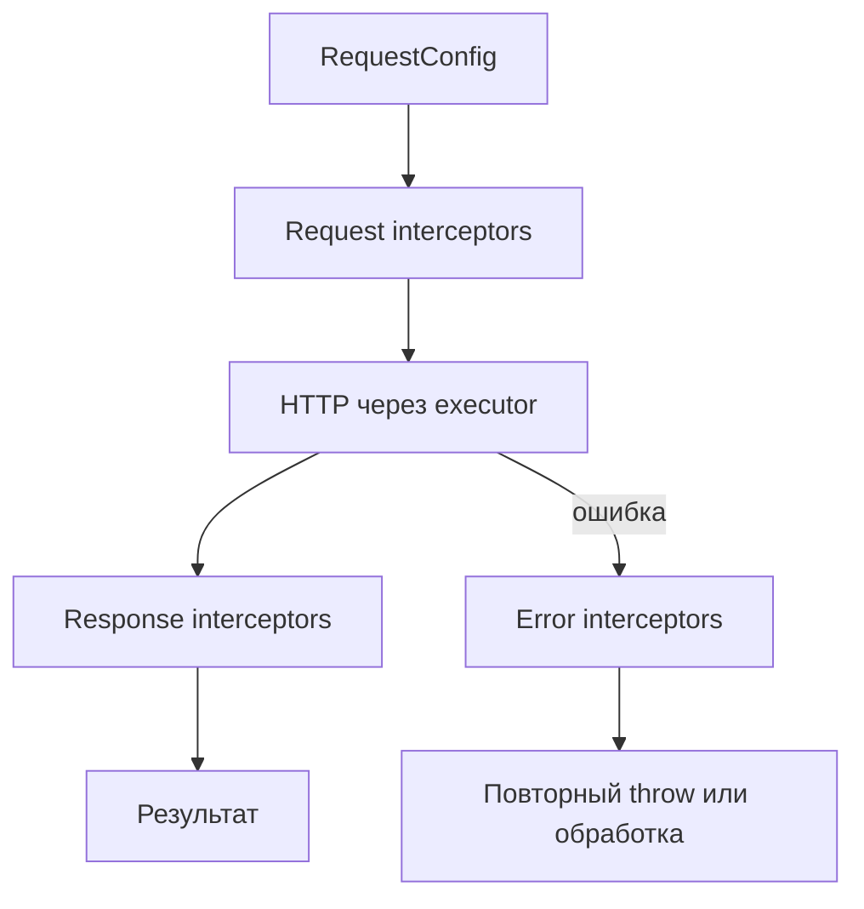

# Руководство по миграции: 1.0.0 -> 2.1.0

Этот документ описывает переход с `1.0.0` на `2.1.0` на основе diff изменений в репозитории.

## Область миграции

Переход включает:
- изменения валидации CLI и формата конфигурации;
- изменения runtime/core архитектуры (executor/interceptors);
- изменения параметров генерации схем;
- обновления системы версионирования и миграции конфигов.

## Ломающие изменения (Breaking Changes)

### 1) Изменился параметр генерации validation-схем

`includeSchemasFiles` удален и заменен на `validationLibrary`.

Было:
```json
{
  "includeSchemasFiles": true
}
```

Стало:
```json
{
  "validationLibrary": "zod"
}
```

Поддерживаемые значения:
- `none` (по умолчанию)
- `zod`
- `joi`
- `yup`
- `jsonschema`

### 2) Добавлен контроль поведения пустых схем

Новый параметр: `emptySchemaStrategy`

Допустимые значения:
- `keep` (по умолчанию)
- `semantic`
- `skip`

Пример:
```json
{
  "validationLibrary": "zod",
  "emptySchemaStrategy": "semantic"
}
```

### 3) Изменилась архитектура runtime/core

Генерация сервисов перешла на модель `RequestExecutor`.

**Было:** сервисы часто вызывали общий `request()` напрямую.

**Стало:** каждый сгенерированный сервис получает `RequestExecutor` в конструкторе и вызывает `executor.request()` или `executor.requestRaw()`.

#### Контракт RequestExecutor

- `request<T>(config, options?)` — возвращает распарсенное тело ответа.
- `requestRaw<T>(config, options?)` — возвращает `ApiResult<T>` (`url`, `ok`, `status`, `statusText`, `body`).
- `RequestConfig` описывает method, path, headers, query, body, media types и опционально `responseType: 'blob'`.

#### Кастомный HTTP-слой

- `request` в конфиге по-прежнему указывает на ваш транспортный модуль.
- `customExecutorPath` может указывать на `createExecutorAdapter` (или свой адаптер), оборачивающий транспорт в `RequestExecutor`.

#### Цепочка interceptors



Порядок: request interceptors → HTTP → response interceptors; при ошибке сначала error interceptors, затем исключение.

Влияние:
- если у вас была кастомная интеграция со старым request-потоком, ее нужно адаптировать под executor-подход;
- в generated core появились/обновились артефакты для executor/interceptors (`core/executor`, interceptor-файлы).

### 4) Унификация схемы конфигурации

Старые семейства конфигов (`OPTIONS`, `MULTI_OPTIONS`) мигрируют в унифицированный формат (`UNIFIED_OPTIONS`).

Влияние:
- старые конфиги должны мигрироваться автоматически;
- если есть внешние инструменты, читающие старую структуру конфига, их нужно обновить.

### 5) Удаленные/устаревшие части

- удален `includeSchemasFiles`;
- legacy-валидация CLI заменена на Zod;
- часть устаревших внутренних helper-утилит и legacy request executor удалена/переработана.

### 6) Ужесточено поведение direct-валидации `generate` в `2.0.0`

Для direct-режима CLI (`--input` + `--output`):
- валидация теперь выполняется через актуальную Zod-схему (`flatOptionsSchema`);
- генерация запускается только при успешной валидации.

Если direct-опции невалидны/пустые и config-файл отсутствует, CLI теперь возвращает более явную и прикладную ошибку.

### 7) Унифицированный diff-отчёт (`2.1.0`)

#### Что изменилось

- Вывод `analyze-diff` по умолчанию теперь `schemaVersion: "2.0.0"` с вложенными блоками `semantic` и `structural`.
- `generate --useHistory` снова работает; `loadDiffReport` автоматически адаптирует отчёты 2.0.0, 1.1.0 и legacy flat.

#### Ломающее изменение для потребителей отчёта

| Было (1.1.0) | Стало (2.0.0) |
|---|---|
| `report.changes` | `report.semantic.changes` |
| `report.summary` | `report.semantic.summary` |
| `report.governance` | `report.semantic.governance` |
| `report.recommendation` | `report.semantic.recommendation` |
| `report.miracles` | `report.structural.miracles` |

Пример (фрагмент):
```json
{
  "schemaVersion": "2.0.0",
  "timestamp": "2026-06-06T12:00:00.000Z",
  "metadata": {
    "base": "compare-with:./openapi/previous.yaml",
    "target": "./openapi/current.yaml",
    "baseHash": "...",
    "targetHash": "..."
  },
  "semantic": {
    "changes": [],
    "summary": { "breaking": 0, "nonBreaking": 0, "informational": 0 },
    "governance": {},
    "recommendation": {}
  },
  "structural": {
    "diff": { "breaking": [], "warnings": [], "info": [], "all": [] },
    "miracles": [],
    "stats": {}
  }
}
```

#### Рекомендуемые шаги миграции

1. Перезапустите `analyze-diff` перед включением или регенерацией с `useHistory`.
2. Обновите CI-скрипты и дашборды, парсящие `openapi-diff-report.json`, на чтение `report.semantic.*`.
3. Для structural-инструментов используйте `report.structural.diff.all` и `report.structural.miracles` напрямую.
4. Перегенерируйте клиенты при `modelsMode: "classes"` или схемах с дублирующимися именами (изменилась нумерация алиасов).
5. Подтверждайте miracles в `report.structural.miracles` — workflow не изменился, изменилось только расположение.

#### Замечания по совместимости

- Изменения CLI-флагов для `generate` и `analyze-diff` не требуются.
- Старые отчёты 1.1.0 по-прежнему загружаются через адаптер; для полной `structural`-точности рекомендуется перегенерировать отчёт.
- Workflow подтверждения miracles не изменился: установите `"status": "confirmed"` перед генерацией.

## Новые/обновленные параметры, которые стоит проверить

Для CLI/config:
- `validationLibrary`
- `emptySchemaStrategy`
- `customExecutorPath`
- `useHistory`, `diffReport` (или `analyze.useHistory` / `analyze.reportPath`)
- `modelsMode` (`interfaces` | `classes`)
- `prettierConfigPath` (опциональный путь к файлу конфигурации Prettier для вывода)
- `tsconfigPath` + `eslintConfigPath` (опциональная пара для пакетного ESLint fix после генерации)
- команда `preview-changes` и ее рабочие директории:
  - `.ts-openapi-codegen-preview-changes`
  - `.ts-openapi-codegen-diff-changes`

## Рекомендуемый порядок миграции

### Шаг 1: Обновите ключи в конфиге

Замените в конфиг-файлах:
- `includeSchemasFiles` -> `validationLibrary`

Рекомендуемое соответствие:
- `includeSchemasFiles: false` -> `validationLibrary: "none"`
- `includeSchemasFiles: true` -> явно выберите библиотеку (`"zod"`, `"joi"`, `"yup"`, `"jsonschema"`)

### Шаг 2: Явно задайте стратегию пустых схем

Рекомендуется явно установить `emptySchemaStrategy`, чтобы избежать неявного поведения.

### Шаг 3: Перегенерируйте код и проверьте runtime-интеграцию

Проверьте:
- интеграцию executor,
- интеграцию interceptors,
- кастомные request/executor адаптеры.

Если используете кастомный executor-модуль, задайте `customExecutorPath`.

### Шаг 4: Провалидируйте и при необходимости обновите конфиги

Запустите:
```bash
openapi-codegen-cli check-config --openapi-config ./openapi.config.json
openapi-codegen-cli update-config --openapi-config ./openapi.config.json
```

### Шаг 5: Просмотрите изменения перед применением

Используйте preview режим:
```bash
openapi-codegen-cli preview-changes --openapi-config ./openapi.config.json
```

### Шаг 6: Обновите тесты/снапшоты

Перезапустите тесты и обновите снапшоты там, где изменился generated runtime/core код.

## Пример до/после

До (`1.0.0` стиль):
```json
{
  "input": "./spec.json",
  "output": "./generated",
  "httpClient": "fetch",
  "includeSchemasFiles": true
}
```

После (`2.x` стиль):
```json
{
  "input": "./spec.json",
  "output": "./generated",
  "httpClient": "fetch",
  "validationLibrary": "zod",
  "emptySchemaStrategy": "keep",
  "customExecutorPath": "./custom/createExecutorAdapter.ts"
}
```

## Примечания по совместимости

- Автомиграция конфигов встроена, но явная очистка/нормализация конфигов рекомендуется.
- Вызов `generate()` напрямую остается доступным, но внутренняя реализация в `2.x` существенно изменилась.
- Если вы использовали удаленные внутренние утилиты, переходите на актуальный публичный поток.

## History‑aware генерация (diff‑отчёт)

**Было:** после изменения API перегенерация могла сломать потребителей незаметно.

**Стало:** можно сгенерировать diff‑отчёт, подтвердить переименования в `miracles` и перегенерировать с `useHistory`.

CLI/конфиг:
- `useHistory` (boolean)
- `diffReport` (путь, по умолчанию `./openapi-diff-report.json`)
- или `analyze.useHistory` / `analyze.reportPath`

Генерация отчёта:
```bash
openapi analyze-diff --input ./openapi/current.yaml --compare-with ./openapi/previous.yaml
```

Пример ручного подтверждения (отредактируйте отчёт перед генерацией). С `2.1.0` `miracles` находятся в `structural.miracles` унифицированного отчёта 2.0.0:
```json
{
  "structural": {
    "miracles": [
      {
        "oldPath": "$.components.schemas.User.properties.user_name",
        "newPath": "$.components.schemas.User.properties.userName",
        "type": "RENAME",
        "confidence": 0.85,
        "status": "confirmed"
      }
    ]
  }
}
```

## Режим моделей: интерфейсы vs классы (DTO/Raw)

**Было:** модели только как TypeScript interfaces.

**Стало:** при `modelsMode: "classes"` генерируются `*Raw` + `*Dto`, а также `BaseDto` и `dtoUtils` в core; подтверждённые miracles могут добавить deprecated‑геттеры в DTO.

## Коэрсинг в схемах валидации

При включённом `useHistory` и смене типа свойства валидаторы могут коэрсить значения:
- Zod: `z.coerce.*`
- Joi: `Joi.alternatives().try(...)`
- Yup: `.transform(...)`
- JSON Schema: AJV `coerceTypes`

## Форматирование сгенерированного кода

**Было:** `useProjectPrettier: true` — резолв Prettier из текущей рабочей директории.

**Стало:** укажите `prettierConfigPath` (CLI `--prettierConfigPath` или в `openapi.config.json`). Если файл существует, TypeScript форматируется по нему; иначе — встроенные настройки.

## Пакетный ESLint после генерации

**Было:** `useEslintFix: true` и пути `tsconfigPath` / `eslintConfigPath`.

**Стало:** укажите **оба** пути `tsconfigPath` и `eslintConfigPath` (CLI или конфиг). Отдельного флага включения нет. Если задан только один путь — batch ESLint пропускается с предупреждением.


## Чеклист миграции

- [ ] Во всех конфигах удален `includeSchemasFiles`.
- [ ] Везде явно задан `validationLibrary`.
- [ ] Везде явно задан `emptySchemaStrategy`.
- [ ] Проверена интеграция request/executor (`RequestExecutor`, interceptors, `customExecutorPath`).
- [ ] `useProjectPrettier` заменён на `prettierConfigPath`, если нужно форматирование Prettier.
- [ ] `useEslintFix: true` заменён на пару `tsconfigPath` + `eslintConfigPath`, если нужен пакетный ESLint fix.
- [ ] Выбран `modelsMode` и при необходимости workflow `useHistory` / diff‑отчёта.
- [ ] Перезапустили `analyze-diff` для получения отчёта 2.0.0.
- [ ] Обновили парсеры отчётов на `report.semantic.*` / `report.structural.*`.
- [ ] Проверили, что `generate --useHistory` подхватывает structural-данные.
- [ ] Проверили изменения импортов duplicate-alias после регенерации.
- [ ] Выполнены `check-config` и `update-config`.
- [ ] Выполнен `preview-changes`, diff проверен.
- [ ] Обновлены тесты/снапшоты.
