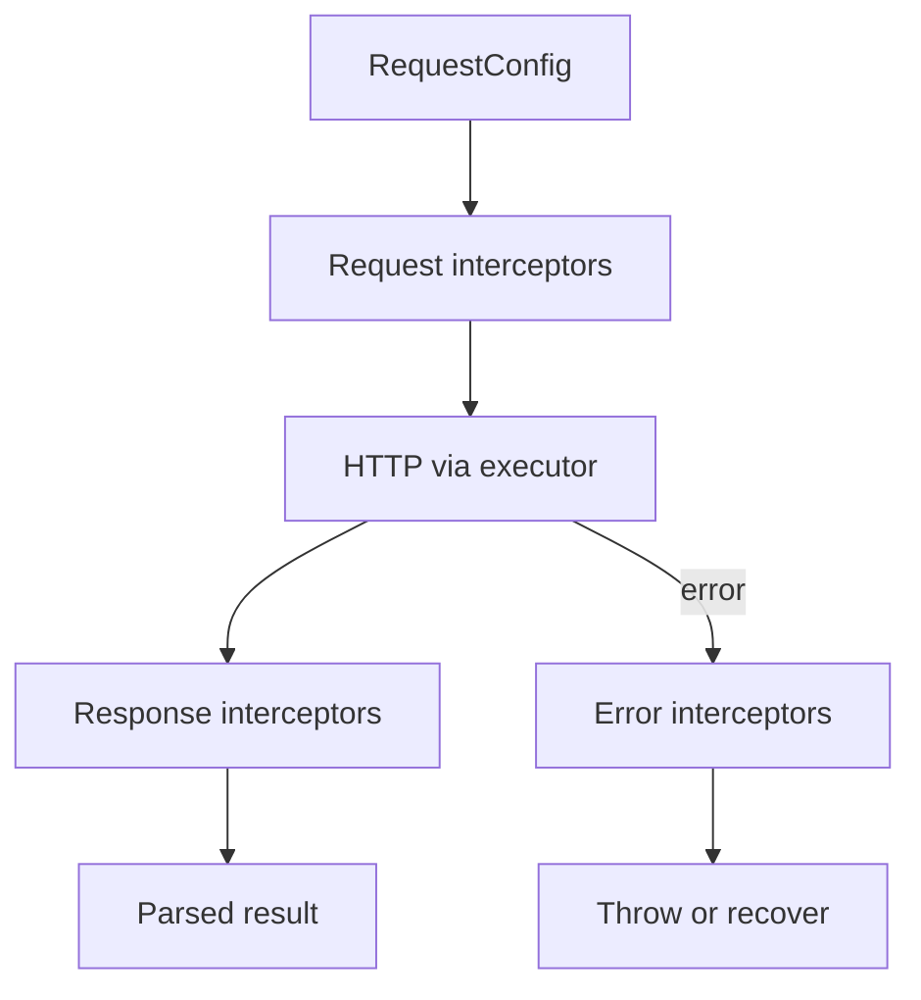

# Migration Guide: 1.0.0 -> 2.1.0

This guide describes how to migrate from `1.0.0` to `2.1.0` based on the repository diff.

## Scope

This migration includes:
- CLI validation and config model changes.
- Runtime/core architecture updates (executor/interceptors).
- Schema generation option changes.
- Config versioning and migration behavior updates.

## Breaking Changes

### 1) Validation schemas option changed

`includeSchemasFiles` was removed and replaced by `validationLibrary`.

Before:
```json
{
  "includeSchemasFiles": true
}
```

After:
```json
{
  "validationLibrary": "zod"
}
```

Supported values:
- `none` (default)
- `zod`
- `joi`
- `yup`
- `jsonschema`

### 2) New empty schema behavior control

New option: `emptySchemaStrategy`

Allowed values:
- `keep` (default)
- `semantic`
- `skip`

Example:
```json
{
  "validationLibrary": "zod",
  "emptySchemaStrategy": "semantic"
}
```

### 3) Core/service runtime architecture changed

Service generation moved to `RequestExecutor`-based runtime.

**Before:** services often called a shared `request()` helper directly.

**After:** each generated service receives a `RequestExecutor` in its constructor and calls `executor.request()` or `executor.requestRaw()`.

#### RequestExecutor contract

- `request<T>(config, options?)` — returns the parsed response body.
- `requestRaw<T>(config, options?)` — returns `ApiResult<T>` (`url`, `ok`, `status`, `statusText`, `body`).
- `RequestConfig` describes method, path, headers, query, body, media types, and optional `responseType: 'blob'`.

#### Custom HTTP layer

- `request` in config still points at your transport module (legacy `ApiRequestOptions` signature); it is copied to `core/request.ts` during generation.
- `customExecutorPath` points at a module exporting `createExecutorAdapter`; it is copied to `core/executor/createExecutorAdapter.ts` during generation (not imported at runtime).
- `createLegacyRequestAdapter(openApiConfig, mapOptions?)` — generated helper for projects keeping a legacy custom `request()` without rewriting to `RequestExecutor` directly. Use via `createClient({ executorFactory: ({ openApiConfig }) => createLegacyRequestAdapter(openApiConfig) })`.
- If your custom transport exports `requestRaw`, the legacy adapter delegates to it; otherwise `requestRaw` synthesizes a minimal `ApiResult` from `request()` (status 200).

#### Interceptor pipeline



Order: request interceptors → HTTP → response interceptors; on failure, error interceptors run before the error is re-thrown.

Error interceptors may return `RequestRecovery(value)` to recover from a failed request; the recovered value passes through response interceptors.

`createClient` always wraps the executor with `withInterceptors` and the default `apiErrorInterceptor` (since `2.1.0-beta.10`).

Transport-level `ApiError` (from `catchErrors`) now stores a slim `request` config and puts the response payload in `body` instead of embedding full `ApiRequestOptions` in `request`.

When `useCancelableRequest` is enabled, `RequestExecutor.request` / `requestRaw` return `CancelablePromise`.

Impact:
- If you had custom runtime integration around the old request flow, update it to executor-based flow.
- New/updated generated core artifacts include executor and interceptor pieces under `core/`.

### 4) Config schema model unified

Legacy config families (`OPTIONS`, `MULTI_OPTIONS`) are migrated to unified schema (`UNIFIED_OPTIONS`).

Impact:
- Older config files should migrate automatically.
- If you had custom tooling reading raw config shape, align with unified model.

### 5) Removed/deprecated pieces

- `includeSchemasFiles` removed.
- Legacy CLI validation path replaced with Zod-based validation layer.
- Some internal legacy helpers and old request executor artifacts removed/refactored.

### 6) Direct `generate` validation behavior was tightened in `2.0.0`

For direct CLI mode (`--input` + `--output`):
- validation is now done via current Zod schema (`flatOptionsSchema`);
- generation runs only on successful validation.

If both direct options are invalid/empty and config file is missing, CLI now returns a clearer actionable error.

### 7) Unified diff report (`2.1.0`)

#### What changed

- `analyze-diff` default output is now `schemaVersion: "2.0.0"` with nested `semantic` and `structural` blocks.
- `generate --useHistory` works again; `loadDiffReport` auto-adapts 2.0.0, 1.1.0, and legacy flat reports.

#### Breaking change for report consumers

| Before (1.1.0) | After (2.0.0) |
|---|---|
| `report.changes` | `report.semantic.changes` |
| `report.summary` | `report.semantic.summary` |
| `report.governance` | `report.semantic.governance` |
| `report.recommendation` | `report.semantic.recommendation` |
| `report.miracles` | `report.structural.miracles` |

Example (excerpt):
```json
{
  "schemaVersion": "2.0.0",
  "timestamp": "2026-06-06T12:00:00.000Z",
  "metadata": {
    "base": "compare-with:./openapi/previous.yaml",
    "target": "./openapi/current.yaml",
    "baseHash": "...",
    "targetHash": "..."
  },
  "semantic": {
    "changes": [],
    "summary": { "breaking": 0, "nonBreaking": 0, "informational": 0 },
    "governance": {},
    "recommendation": {}
  },
  "structural": {
    "diff": { "breaking": [], "warnings": [], "info": [], "all": [] },
    "miracles": [],
    "stats": {}
  }
}
```

#### Recommended migration steps

1. Re-run `analyze-diff` before enabling or regenerating with `useHistory`.
2. Update CI scripts and dashboards parsing `openapi-diff-report.json` to read `report.semantic.*`.
3. For structural tooling, use `report.structural.diff.all` and `report.structural.miracles` directly.
4. Regenerate clients if using `modelsMode: "classes"` or schemas with duplicate names (alias numbering changed).
5. Confirm miracles in `report.structural.miracles` — workflow unchanged, location moved.

#### Compatibility notes

- No CLI flag changes required for `generate` or `analyze-diff`.
- Old 1.1.0 reports are still loadable via adapter; re-generate for full `structural` fidelity.
- Miracles confirmation workflow is unchanged: set `"status": "confirmed"` before generation.

### 8) Marauder feature set (`2.2.0`)

The "Marauder" features (auto-selection, anomaly detection, gradual migration planning, Avatar Swarm) are **additive and opt-in**. There are no breaking changes for existing configs; everything is off by default.

#### Config schema V6 (auto-migration)

The latest unified config schema is now `UNIFIED_OPTIONS_v6`. It adds two optional blocks. Run:

```bash
openapi-codegen-cli update-config --openapi-config ./openapi.config.json
```

New optional config blocks (defaults shown):

```json
{
  "autoSelect": {
    "enabled": false,
    "strict": false,
    "preferSmallBundles": false,
    "preferStandards": false
  },
  "anomalyDetection": {
    "enabled": false,
    "severity": "medium",
    "reportFormat": "json",
    "reportPath": "./anomaly-report.json"
  }
}
```

#### New CLI commands

```bash
# Plan a gradual, zero-downtime migration between two clients
openapi-codegen-cli migrate --from-client axios-client --to-client fetch-client --strategy canary

# Orchestrate multiple specs into an Avatar Swarm with reports
openapi-codegen-cli swarm --specs-dir ./specs --output ./generated-swarm --report-format all
```

#### Programmatic (library-only) APIs

```ts
import {
  GradualMigrationPlanner,
  TrafficSplitter,
  ChangeDetector,
  SelfHealingClient,
  AnomalyExploiter,
} from 'ts-openapi-codegen/core';
```

#### Preview limitations to be aware of

- `--anomaly-detection` is recognized but not yet executed during `generate`; use the `AnomalyDetector` API or the `swarm` command.
- `--auto-select` currently applies only when generating from `openapi.config.json`, not for direct `--input`/`--output` runs.
- `migrate` and `swarm` produce plans/reports only; they do not perform live traffic migration or emit full client trees yet.

## New/Updated Options You Should Review

For CLI/config:
- `validationLibrary`
- `emptySchemaStrategy`
- `customExecutorPath`
- `requestFormat` on `init` (`transport` | `adapter` | `executor`) — selects scaffold type and sets `request` vs `customExecutorPath` in generated config
- `executorFactory` on generated `createClient()` — runtime hook to wrap the default executor (legacy adapter, retry, tracing)
- `useHistory`, `diffReport` (or `analyze.useHistory` / `analyze.reportPath`)
- `modelsMode` (`interfaces` | `classes`)
- `prettierConfigPath` (optional path to a Prettier config file for generated output)
- `tsconfigPath` + `eslintConfigPath` (optional pair to enable batch ESLint fix after generation)
- `autoSelect` / `--auto-select` (preview: project-aware client & validator selection)
- `anomalyDetection` / `--anomaly-detection` (preview: OpenAPI anomaly reporting)
- `migrate` and `swarm` commands (preview)
- `previewChanges` command and its folders:
  - `.ts-openapi-codegen-preview-changes`
  - `.ts-openapi-codegen-diff-changes`

## Recommended Migration Steps

### Step 1: Update config keys

Replace in config files:
- `includeSchemasFiles` -> `validationLibrary`

Suggested mapping:
- `includeSchemasFiles: false` -> `validationLibrary: "none"`
- `includeSchemasFiles: true` -> choose explicit library (`"zod"`, `"joi"`, `"yup"`, or `"jsonschema"`)

### Step 2: Add strategy for empty schemas (optional but recommended)

Set `emptySchemaStrategy` explicitly to avoid ambiguity across environments.

### Step 3: Regenerate and review core runtime integration

Regenerate clients and check:
- executor integration,
- interceptor integration,
- custom request/executor adapters.

If you use custom adapter module, set `customExecutorPath` (file is copied into generated core on regen).

If you keep a legacy custom `request()` and do not want a full executor rewrite, regenerate and use `createLegacyRequestAdapter` via `executorFactory`, or set `"request"` in config so the default `createExecutorAdapter` maps `RequestConfig` automatically.

Run `check-config` to surface missing `request` / `customExecutorPath` files and invalid `createExecutorAdapter` exports.

### Step 4: Validate and migrate config files

Run:
```bash
openapi-codegen-cli check-config --openapi-config ./openapi.config.json
openapi-codegen-cli update-config --openapi-config ./openapi.config.json
```

Since `2.1.0-beta.10`, `check-config` also emits non-fatal **Executor config** warnings when `request` or `customExecutorPath` files are missing, or when `customExecutorPath` does not export `function createExecutorAdapter`.

### Step 5: Verify generated diffs before applying

Use preview mode:
```bash
openapi-codegen-cli preview-changes --openapi-config ./openapi.config.json
```

### Step 6: Re-run tests/snapshots

Rebuild and update snapshots where runtime/core output changed.

## Before/After Example

Before (`1.0.0` style):
```json
{
  "input": "./spec.json",
  "output": "./generated",
  "httpClient": "fetch",
  "includeSchemasFiles": true
}
```

After (`2.x` style):
```json
{
  "input": "./spec.json",
  "output": "./generated",
  "httpClient": "fetch",
  "validationLibrary": "zod",
  "emptySchemaStrategy": "keep",
  "customExecutorPath": "./custom/createExecutorAdapter.ts"
}
```

## Compatibility Notes

- Config migration is built in, but explicit config cleanup is recommended.
- Direct `generate()` usage remains available, but internals changed significantly in `2.x`.
- If you depended on removed internal utilities, refactor to current public flow.

## History-aware generation (diff report)

**Before:** regenerating after an API change could break consumers silently.

**After:** you can generate a diff report, confirm renames in `miracles`, and regenerate with `useHistory`.

CLI/config:
- `useHistory` (boolean)
- `diffReport` (path, default: `./openapi-diff-report.json`)
- or `analyze.useHistory` / `analyze.reportPath` in config

Generate the report:
```bash
openapi analyze-diff --input ./openapi/current.yaml --compare-with ./openapi/previous.yaml
```

Manual confirmation example (edit the report before generation). Since `2.1.0`, `miracles` live in `structural.miracles` of the unified 2.0.0 report:
```json
{
  "structural": {
    "miracles": [
      {
        "oldPath": "$.components.schemas.User.properties.user_name",
        "newPath": "$.components.schemas.User.properties.userName",
        "type": "RENAME",
        "confidence": 0.85,
        "status": "confirmed"
      }
    ]
  }
}
```

## Models mode: interfaces vs classes (DTO/Raw)

**Before:** models were TypeScript interfaces only.

**After:** `modelsMode: "classes"` generates `*Raw` + `*Dto`, plus `BaseDto` and `dtoUtils` in core; confirmed miracles can add deprecated getters on DTOs.

## Coercion in validation schemas

When `useHistory` is on and a property type changes, validation schemas may coerce values:
- Zod: `z.coerce.*`
- Joi: `Joi.alternatives().try(...)`
- Yup: `.transform(...)`
- JSON Schema: AJV `coerceTypes`

## Formatting generated output

**Before:** `useProjectPrettier: true` resolved Prettier from the current working directory.

**After:** set `prettierConfigPath` (CLI `--prettierConfigPath` or in `openapi.config.json`). If the file exists, generated TypeScript is formatted with it; if not, built-in defaults are used.

## Batch ESLint fix after generation

**Before:** `useEslintFix: true` plus `tsconfigPath` and `eslintConfigPath`.

**After:** set **both** `tsconfigPath` and `eslintConfigPath` (CLI or config). No separate enable flag. If only one path is set, batch ESLint is skipped with a warning.

## Migration Checklist

- [ ] Replaced `includeSchemasFiles` in all configs.
- [ ] Selected and set `validationLibrary` explicitly.
- [ ] Selected and set `emptySchemaStrategy` explicitly.
- [ ] Chose migration path: `customExecutorPath` vs legacy `request` + `createLegacyRequestAdapter` (or `init --requestFormat`).
- [ ] Reviewed custom request/executor integration (`RequestExecutor`, interceptors, `customExecutorPath`, `createLegacyRequestAdapter`).
- [ ] Ran `check-config` for `request` / `customExecutorPath` warnings.
- [ ] Replaced `useProjectPrettier` with `prettierConfigPath` where you still want Prettier formatting.
- [ ] Replaced `useEslintFix: true` with `tsconfigPath` + `eslintConfigPath` where you still want batch ESLint fix.
- [ ] Decided on `modelsMode` and optional `useHistory` / diff report workflow.
- [ ] Re-ran `analyze-diff` to produce 2.0.0 report.
- [ ] Updated report parsers to `report.semantic.*` / `report.structural.*`.
- [ ] Verified `generate --useHistory` picks up structural data.
- [ ] Reviewed duplicate-alias import changes after regeneration.
- [ ] Ran `check-config` and `update-config`.
- [ ] Ran `preview-changes` and reviewed diffs.
- [ ] Updated snapshots/tests.
