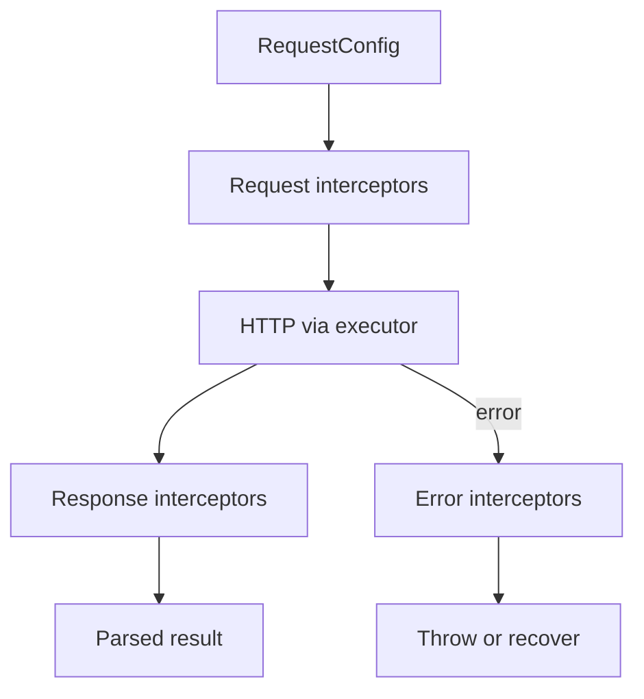

# Migration Guide: 1.0.0 -> 2.0.0

This guide describes how to migrate from `1.0.0` to `2.0.0` based on the repository diff.

## Scope

This migration includes:
- CLI validation and config model changes.
- Runtime/core architecture updates (executor/interceptors).
- Schema generation option changes.
- Config versioning and migration behavior updates.

## Breaking Changes

### 1) Validation schemas option changed

`includeSchemasFiles` was removed and replaced by `validationLibrary`.

Before:
```json
{
  "includeSchemasFiles": true
}
```

After:
```json
{
  "validationLibrary": "zod"
}
```

Supported values:
- `none` (default)
- `zod`
- `joi`
- `yup`
- `jsonschema`

### 2) New empty schema behavior control

New option: `emptySchemaStrategy`

Allowed values:
- `keep` (default)
- `semantic`
- `skip`

Example:
```json
{
  "validationLibrary": "zod",
  "emptySchemaStrategy": "semantic"
}
```

### 3) Core/service runtime architecture changed

Service generation moved to `RequestExecutor`-based runtime.

**Before:** services often called a shared `request()` helper directly.

**After:** each generated service receives a `RequestExecutor` in its constructor and calls `executor.request()` or `executor.requestRaw()`.

#### RequestExecutor contract

- `request<T>(config, options?)` — returns the parsed response body.
- `requestRaw<T>(config, options?)` — returns `ApiResult<T>` (`url`, `ok`, `status`, `statusText`, `body`).
- `RequestConfig` describes method, path, headers, query, body, media types, and optional `responseType: 'blob'`.

#### Custom HTTP layer

- `request` in config still points at your transport module.
- `customExecutorPath` can point at `createExecutorAdapter` (or your own adapter) to wrap that transport in a `RequestExecutor`.

#### Interceptor pipeline



Order: request interceptors → HTTP → response interceptors; on failure, error interceptors run before the error is re-thrown.

Impact:
- If you had custom runtime integration around the old request flow, update it to executor-based flow.
- New/updated generated core artifacts include executor and interceptor pieces under `core/`.

### 4) Config schema model unified

Legacy config families (`OPTIONS`, `MULTI_OPTIONS`) are migrated to unified schema (`UNIFIED_OPTIONS`).

Impact:
- Older config files should migrate automatically.
- If you had custom tooling reading raw config shape, align with unified model.

### 5) Removed/deprecated pieces

- `includeSchemasFiles` removed.
- Legacy CLI validation path replaced with Zod-based validation layer.
- Some internal legacy helpers and old request executor artifacts removed/refactored.

### 6) Direct `generate` validation behavior was tightened in `2.0.0`

For direct CLI mode (`--input` + `--output`):
- validation is now done via current Zod schema (`flatOptionsSchema`);
- generation runs only on successful validation.

If both direct options are invalid/empty and config file is missing, CLI now returns a clearer actionable error.

## New/Updated Options You Should Review

For CLI/config:
- `validationLibrary`
- `emptySchemaStrategy`
- `customExecutorPath`
- `useHistory`, `diffReport` (or `analyze.useHistory` / `analyze.reportPath`)
- `modelsMode` (`interfaces` | `classes`)
- `prettierConfigPath` (optional path to a Prettier config file for generated output)
- `tsconfigPath` + `eslintConfigPath` (optional pair to enable batch ESLint fix after generation)
- `previewChanges` command and its folders:
  - `.ts-openapi-codegen-preview-changes`
  - `.ts-openapi-codegen-diff-changes`

## Recommended Migration Steps

### Step 1: Update config keys

Replace in config files:
- `includeSchemasFiles` -> `validationLibrary`

Suggested mapping:
- `includeSchemasFiles: false` -> `validationLibrary: "none"`
- `includeSchemasFiles: true` -> choose explicit library (`"zod"`, `"joi"`, `"yup"`, or `"jsonschema"`)

### Step 2: Add strategy for empty schemas (optional but recommended)

Set `emptySchemaStrategy` explicitly to avoid ambiguity across environments.

### Step 3: Regenerate and review core runtime integration

Regenerate clients and check:
- executor integration,
- interceptor integration,
- custom request/executor adapters.

If you use custom adapter module, set `customExecutorPath`.

### Step 4: Validate and migrate config files

Run:
```bash
openapi-codegen-cli check-config --openapi-config ./openapi.config.json
openapi-codegen-cli update-config --openapi-config ./openapi.config.json
```

### Step 5: Verify generated diffs before applying

Use preview mode:
```bash
openapi-codegen-cli preview-changes --openapi-config ./openapi.config.json
```

### Step 6: Re-run tests/snapshots

Rebuild and update snapshots where runtime/core output changed.

## Before/After Example

Before (`1.0.0` style):
```json
{
  "input": "./spec.json",
  "output": "./generated",
  "httpClient": "fetch",
  "includeSchemasFiles": true
}
```

After (`2.x` style):
```json
{
  "input": "./spec.json",
  "output": "./generated",
  "httpClient": "fetch",
  "validationLibrary": "zod",
  "emptySchemaStrategy": "keep",
  "customExecutorPath": "./custom/createExecutorAdapter.ts"
}
```

## Compatibility Notes

- Config migration is built in, but explicit config cleanup is recommended.
- Direct `generate()` usage remains available, but internals changed significantly in `2.x`.
- If you depended on removed internal utilities, refactor to current public flow.

## History-aware generation (diff report)

**Before:** regenerating after an API change could break consumers silently.

**After:** you can generate a diff report, confirm renames in `miracles`, and regenerate with `useHistory`.

CLI/config:
- `useHistory` (boolean)
- `diffReport` (path, default: `./openapi-diff-report.json`)
- or `analyze.useHistory` / `analyze.reportPath` in config

Generate the report:
```bash
openapi analyze-diff --input ./openapi/current.yaml --compare-with ./openapi/previous.yaml
```

Example confirmed rename in the report:
```json
{
  "miracles": [
    {
      "oldPath": "$.components.schemas.User.properties.user_name",
      "newPath": "$.components.schemas.User.properties.userName",
      "type": "RENAME",
      "confidence": 0.85,
      "status": "confirmed"
    }
  ]
}
```

## Models mode: interfaces vs classes (DTO/Raw)

**Before:** models were TypeScript interfaces only.

**After:** `modelsMode: "classes"` generates `*Raw` + `*Dto`, plus `BaseDto` and `dtoUtils` in core; confirmed miracles can add deprecated getters on DTOs.

## Coercion in validation schemas

When `useHistory` is on and a property type changes, validation schemas may coerce values:
- Zod: `z.coerce.*`
- Joi: `Joi.alternatives().try(...)`
- Yup: `.transform(...)`
- JSON Schema: AJV `coerceTypes`

## Formatting generated output

**Before:** `useProjectPrettier: true` resolved Prettier from the current working directory.

**After:** set `prettierConfigPath` (CLI `--prettierConfigPath` or in `openapi.config.json`). If the file exists, generated TypeScript is formatted with it; if not, built-in defaults are used.

## Batch ESLint fix after generation

**Before:** `useEslintFix: true` plus `tsconfigPath` and `eslintConfigPath`.

**After:** set **both** `tsconfigPath` and `eslintConfigPath` (CLI or config). No separate enable flag. If only one path is set, batch ESLint is skipped with a warning.

## Migration Checklist

- [ ] Replaced `includeSchemasFiles` in all configs.
- [ ] Selected and set `validationLibrary` explicitly.
- [ ] Selected and set `emptySchemaStrategy` explicitly.
- [ ] Reviewed custom request/executor integration (`RequestExecutor`, interceptors, `customExecutorPath`).
- [ ] Replaced `useProjectPrettier` with `prettierConfigPath` where you still want Prettier formatting.
- [ ] Replaced `useEslintFix: true` with `tsconfigPath` + `eslintConfigPath` where you still want batch ESLint fix.
- [ ] Decided on `modelsMode` and optional `useHistory` / diff report workflow.
- [ ] Ran `check-config` and `update-config`.
- [ ] Ran `preview-changes` and reviewed diffs.
- [ ] Updated snapshots/tests.
