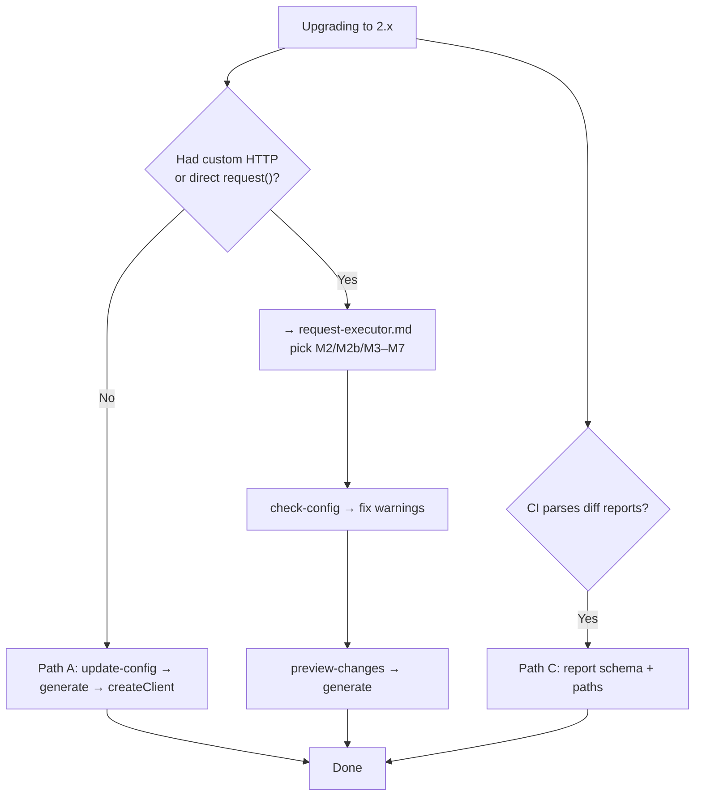

# Migration guide (1.x → 2.x)

Upgrade path for `ts-openapi-codegen` 2.0+. For the full breaking-changes list see [MIGRATION.md](../../MIGRATION.md) at the repo root.

## Choose your path



| Path | When | Doc |
|------|------|-----|
| **A** | Default HTTP, no custom transport | [Getting started](getting-started.md) |
| **B** | Custom `request.ts`, ky, auth, executor warnings | **[RequestExecutor hub](request-executor.md)** |
| **C** | CI consumes `analyze-diff` JSON | [MIGRATION.md § diff report](../../MIGRATION.md#7-unified-diff-report-210) |

---

## Path A — standard upgrade (≤6 steps)

1. Replace `includeSchemasFiles` → `validationLibrary` (`none` | `zod` | `joi` | `yup` | `jsonschema`).
2. Set `emptySchemaStrategy` explicitly (`keep` | `semantic` | `skip`).
3. Run `openapi-codegen-cli update-config --openapi-config ./openapi.config.json`.
4. Run `openapi-codegen-cli preview-changes`.
5. Regenerate: `openapi-codegen-cli generate --openapi-config ./openapi.config.json`.
6. Update app code to use `createClient({ openApi: { BASE: '...' } })` instead of direct `request()` calls.

Example config after:

```json
{
  "input": "./spec.json",
  "output": "./generated",
  "httpClient": "fetch",
  "validationLibrary": "zod",
  "emptySchemaStrategy": "keep"
}
```

---

## Path B — custom HTTP (primary for upgraders)

If you had a custom transport, called `request()` from app code, or `check-config` shows executor warnings:

### Checklist

1. `openapi-codegen-cli update-config`
2. `openapi-codegen-cli check-config` — note executor warnings
3. Open **[request-executor.md](request-executor.md)** → pick M-scenario (M2, M2b, M3–M7, M6, M9)
4. Update config (`request` / `customExecutorPath`) or runtime (`createClient` / `interceptors` / `executorFactory`)
5. `openapi-codegen-cli init --request ./path --requestFormat transport|adapter|executor` if scaffolding from scratch
6. `openapi-codegen-cli preview-changes`
7. `generate` + update app code (`createClient`, service constructors)
8. Tests: mock executor ([M9](request-executor.md#m9--mock-executor-in-tests))

### Breaking changes (RequestExecutor — highlighted)

| Change | Action |
|--------|--------|
| Services require `RequestExecutor` | Use `createClient()` or inject executor |
| `createClient` always applies interceptors | Expected; custom `onError` chains after `apiErrorInterceptor` |
| `ApiError` shape (2.1.0-beta.10) | Payload in `error.body`; slim `error.request` |
| `"request"` vs `customExecutorPath` | See [hub glossary](request-executor.md#glossary) |
| `createLegacyRequestAdapter` | M2b only; synthetic status 200 |

Full RequestExecutor content: **[request-executor.md](request-executor.md)** (not duplicated here).

---

## Path C — diff report consumers

Report schema changed to `2.0.0` in 2.1.0:

| Before (1.1.0) | After (2.0.0) |
|----------------|---------------|
| `report.changes` | `report.semantic.changes` |
| `report.summary` | `report.semantic.summary` |
| `report.miracles` | `report.structural.miracles` |

Steps:

1. Re-run `analyze-diff` before `useHistory`.
2. Update CI parsers to `semantic.*` / `structural.*`.
3. Confirm miracles: set `"status": "confirmed"` in report.

Details: [MIGRATION.md](../../MIGRATION.md).

---

## Other breaking changes (quick reference)

| Area | Before | After |
|------|--------|-------|
| Schemas | `includeSchemasFiles: true` | `validationLibrary: "zod"` (explicit) |
| Prettier | `useProjectPrettier: true` | `prettierConfigPath: "./.prettierrc"` |
| ESLint fix | `useEslintFix: true` | both `tsconfigPath` + `eslintConfigPath` |
| HTTP config key | sometimes `"client"` in old docs | **`httpClient`** in schema V6 |
| CLI name | `openapi` in old examples | **`openapi-codegen-cli`** |

---

## Migration checklist

- [ ] Replaced `includeSchemasFiles` in all configs
- [ ] Set `validationLibrary` and `emptySchemaStrategy`
- [ ] **Path B:** chose M-scenario in [request-executor.md](request-executor.md)
- [ ] Ran `check-config` for executor warnings
- [ ] Ran `preview-changes` and reviewed diffs
- [ ] App uses `createClient({ openApi })`
- [ ] **Path C:** updated diff report parsers
- [ ] Updated tests/snapshots

---

## Related

- [MIGRATION.md](../../MIGRATION.md) — complete breaking changes
- [RequestExecutor hub](request-executor.md)
- [Config recipes](config-recipes.md)
- [Getting started](getting-started.md)
