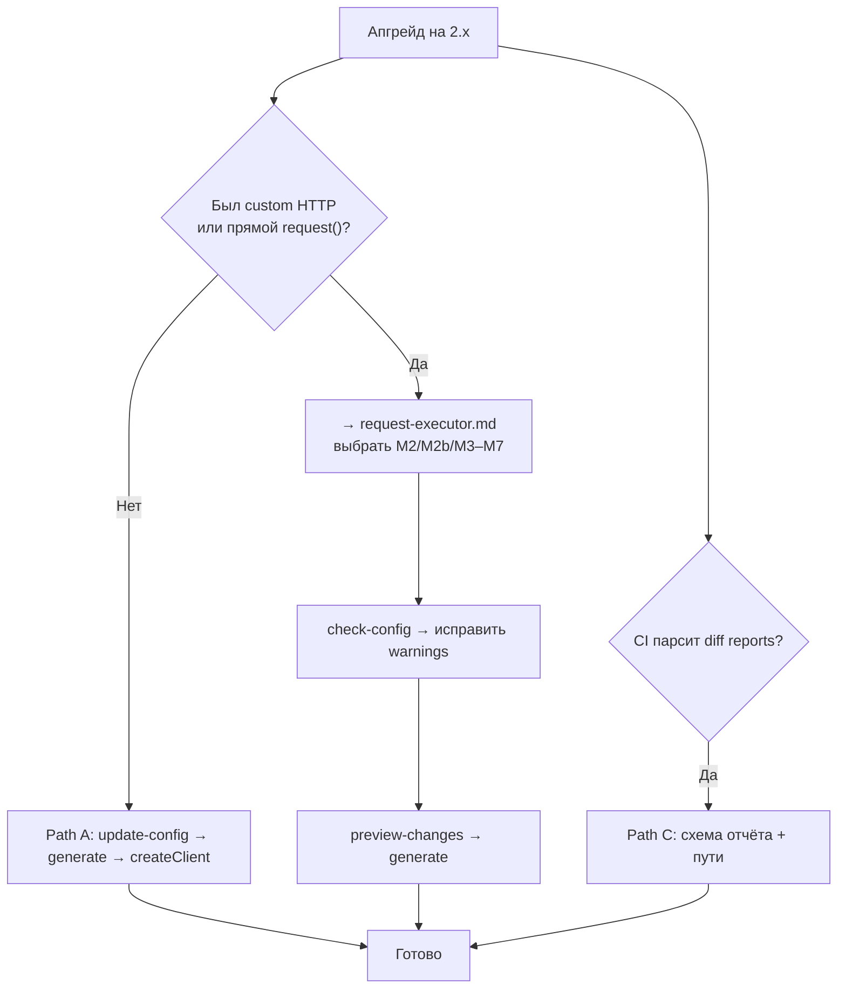

# Руководство по миграции (1.x → 2.x)

Путь апгрейда для `ts-openapi-codegen` 2.0+. Полный список breaking changes — [MIGRATION.RU.md](../../MIGRATION.RU.md).

## Выберите путь



| Путь | Когда | Документ |
|------|-------|----------|
| **A** | Дефолтный HTTP, без custom transport | [Быстрый старт](getting-started.md) |
| **B** | Custom `request.ts`, ky, auth, warnings executor | **[RequestExecutor hub](request-executor.md)** |
| **C** | CI потребляет JSON `analyze-diff` | [MIGRATION.RU.md § diff report](../../MIGRATION.RU.md) |

---

## Path A — стандартный апгрейд (≤6 шагов)

1. Заменить `includeSchemasFiles` → `validationLibrary` (`none` | `zod` | `joi` | `yup` | `jsonschema`).
2. Явно задать `emptySchemaStrategy` (`keep` | `semantic` | `skip`).
3. `openapi-codegen-cli update-config --openapi-config ./openapi.config.json`
4. `openapi-codegen-cli preview-changes`
5. `openapi-codegen-cli generate --openapi-config ./openapi.config.json`
6. Обновить app: `createClient({ openApi: { BASE: '...' } })` вместо прямого `request()`.

Пример конфига после:

```json
{
  "input": "./spec.json",
  "output": "./generated",
  "httpClient": "fetch",
  "validationLibrary": "zod",
  "emptySchemaStrategy": "keep"
}
```

---

## Path B — custom HTTP (основной для апгрейдеров)

Custom transport, прямые вызовы `request()`, предупреждения executor в `check-config`:

### Чеклист

1. `openapi-codegen-cli update-config`
2. `openapi-codegen-cli check-config` — записать executor warnings
3. Открыть **[request-executor.md](request-executor.md)** → выбрать M-сценарий
4. Обновить конфиг (`request` / `customExecutorPath`) или runtime (`createClient` / `interceptors` / `executorFactory`)
5. `openapi-codegen-cli init --request ./path --requestFormat transport|adapter|executor` при scaffold с нуля
6. `openapi-codegen-cli preview-changes`
7. `generate` + обновить app (`createClient`, конструкторы сервисов)
8. Тесты: mock executor ([M9](request-executor.md#m9--mock-executor-в-тестах))

### Breaking changes (RequestExecutor)

| Изменение | Действие |
|-----------|----------|
| Сервисы требуют `RequestExecutor` | `createClient()` или inject executor |
| `createClient` всегда применяет interceptors | Ожидаемо; custom `onError` после `apiErrorInterceptor` |
| Форма `ApiError` (2.1.0-beta.10) | Payload в `error.body`; компактный `error.request` |
| `"request"` vs `customExecutorPath` | [Глоссарий hub](request-executor.md#глоссарий) |
| `createLegacyRequestAdapter` | Только M2b; синтетический status 200 |

Полное содержание RequestExecutor: **[request-executor.md](request-executor.md)**.

---

## Path C — потребители diff report

Схема отчёта `2.0.0` в 2.1.0:

| Было (1.1.0) | Стало (2.0.0) |
|--------------|---------------|
| `report.changes` | `report.semantic.changes` |
| `report.summary` | `report.semantic.summary` |
| `report.miracles` | `report.structural.miracles` |

1. Перезапустить `analyze-diff` перед `useHistory`.
2. Обновить CI-парсеры на `semantic.*` / `structural.*`.
3. Подтвердить miracles: `"status": "confirmed"` в отчёте.

---

## Прочие breaking changes

| Область | Было | Стало |
|---------|------|-------|
| Schemas | `includeSchemasFiles: true` | `validationLibrary: "zod"` (явно) |
| Prettier | `useProjectPrettier: true` | `prettierConfigPath: "./.prettierrc"` |
| ESLint fix | `useEslintFix: true` | оба `tsconfigPath` + `eslintConfigPath` |
| Ключ HTTP | `"client"` в старых docs | **`httpClient`** в schema V6 |
| Имя CLI | `openapi` в старых примерах | **`openapi-codegen-cli`** |

---

## Чеклист миграции

- [ ] Заменён `includeSchemasFiles` во всех конфигах
- [ ] Заданы `validationLibrary` и `emptySchemaStrategy`
- [ ] **Path B:** выбран M-сценарий в [request-executor.md](request-executor.md)
- [ ] Запущен `check-config` для executor warnings
- [ ] Запущен `preview-changes`, diff просмотрен
- [ ] App использует `createClient({ openApi })`
- [ ] **Path C:** обновлены парсеры diff report
- [ ] Обновлены тесты/snapshots

---

## Связанные документы

- [MIGRATION.RU.md](../../MIGRATION.RU.md)
- [RequestExecutor hub](request-executor.md)
- [Рецепты конфигов](config-recipes.md)
- [Быстрый старт](getting-started.md)

**English:** [migration.md (EN)](../en/migration.md)
