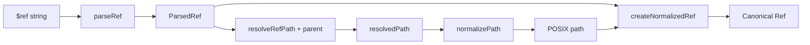

# 2. normalizeRef / parseRef / resolveRefPath / normalizePath / createNormalizedRef

Дата: 2026-08-21  
Фокус: пайплайн канонизации `$ref` и кросс-ОС проблемы.

---

## Обзор пайплайна

Единая точка входа — `normalizeRef(ref, parentFilePath, pathApi?)` (`src/core/utils/normalizeRef.ts`):

```
normalizeRef
  = parseRef(ref)
  → resolveRefPath(parsed, parent)
  → normalizePath(resolved)
  → createNormalizedRef(parsed, normalized)
```



**Архитектурное решение:** до любого path API ref режется через `splitCanonicalRef` в `(sourceFile, pointer?)`. Pointer **никогда** не попадает в `path.normalize` / `resolve`. Hazard-тест: `path.win32.normalize('C:/proj/api.yaml#/components/schemas/Foo')` превращает pointer в `#\components\...` (`canonicalRef.windows.test.ts:43-46`).

**Канонический формат результата:**

- Файловая часть: только `/`
- POSIX abs: `/abs/path/file.yaml`
- Windows drive: `C:/path/file.yaml` (без ведущего `/` перед буквой)
- HTTP(S): исходная строка без изменений
- Fragment: `#/components/schemas/Foo` — как есть, без decode
- Формула: `normalizedSourceFile + pointer?`

`PathApi` (`pathApi.ts`): injectable `{ isAbsolute, normalize, dirname, resolve, relative }`. Production — host `path`. Тесты Windows — `path.win32` на darwin.

Главный caller — `Context.normalizeRefForLookup`.

---

## parseRef (`src/core/utils/parseRef.ts`)

### RefType

```
LOCAL_FRAGMENT
EXTERNAL_FILE
EXTERNAL_FILE_FRAGMENT
HTTP_URL
ABSOLUTE_PATH
```

### Алгоритм

1. Пустой / не-string → `LOCAL_FRAGMENT`.
2. `http://` / `https://` → `HTTP_URL` (fragment **не** выделяется в поле).
3. `splitCanonicalRef(ref)` → `(sourceFile, pointer?)`.
4. Пустой `sourceFile` + есть pointer → `LOCAL_FRAGMENT`.
5. `pathApi.isAbsolute(sourceFile)` **или** `isWindowsDrivePath(sourceFile)` → `ABSOLUTE_PATH`.
6. Иначе с pointer → `EXTERNAL_FILE_FRAGMENT`, без → `EXTERNAL_FILE`.

`isWindowsDrivePath`: `/^[A-Za-z]:[\\/]/` — буква диска **с** `/` или `\` сразу после `:`.

`splitCanonicalRef`: первый `#` — граница. Ref, начинающийся с `#` → `{ sourceFile: '', pointer: ref }`.

### Примеры разбора

| Input | RefType | filePath | fragment |
|-------|---------|----------|----------|
| `#/a/b` | LOCAL_FRAGMENT | — | `#/a/b` |
| `./x.yaml` | EXTERNAL_FILE | `./x.yaml` | — |
| `./x.yaml#/Foo` | EXTERNAL_FILE_FRAGMENT | `./x.yaml` | `#/Foo` |
| `/abs/x.yaml` | ABSOLUTE_PATH | `/abs/x.yaml` | — |
| `C:\x.yaml` | ABSOLUTE_PATH | `C:\x.yaml` | — |
| `C:/x.yaml` | ABSOLUTE_PATH | `C:/x.yaml` | — |
| `C:/x.yaml#/Foo` | ABSOLUTE_PATH | `C:/x.yaml` | `#/Foo` |
| `file:///C:/x.yaml` | **EXTERNAL_FILE** | `file:///C:/x.yaml` | — |
| `https://host/a.yaml` | HTTP_URL | — | — |
| `https://host/a.yaml#/Foo` | HTTP_URL | — | — (живёт в `originalRef`) |
| `\\server\share\f.yaml` + win32 | ABSOLUTE_PATH | native UNC | — |
| `//server/share/f.yaml` + posix | ABSOLUTE_PATH | `//server/...` | — |
| `C:x.yaml` (без slash после `:`) | EXTERNAL_FILE | `C:x.yaml` | — |

### Кросс-ОС проблемы parseRef

1. **`file://` не URL** — EXTERNAL_FILE, дальше ломается в resolve.
2. **`C:x.yaml` без slash** — не ABSOLUTE_PATH; Windows drive-relative не моделируется.
3. **UNC на POSIX-хосте:** `\\server\share\...` → EXTERNAL_FILE (`path.posix.isAbsolute` = false).
4. **HTTP + fragment:** поле `fragment` пусто, но `createNormalizedRef` возвращает `originalRef` — на выходе `normalizeRef` fragment сохраняется.
5. **Двойной `#`:** `./x.yaml##/Foo` → fragment `##/Foo`.
6. Encoded pointers (`#/components~1...`) не декодируются — корректно для identity.

---

## resolveRefPath (`src/core/utils/resolveRefPath.ts`)

```
parentSource = splitCanonicalRef(parentFilePath).sourceFile
parentDir    = toPosixPath(pathApi.dirname(parentSource))
```

| RefType | Результат |
|---------|-----------|
| LOCAL_FRAGMENT | `parentSource` |
| EXTERNAL_FILE / EXTERNAL_FILE_FRAGMENT | `toPosixPath(pathApi.resolve(parentDir, filePath))` |
| ABSOLUTE_PATH | `filePath` as-is, без resolve |
| HTTP_URL | `originalRef` |

Fragment parent отрезается. Fragment ref в path resolve не участвует.

### Главный кросс-ОС баг

На **POSIX-хосте** с `defaultPathApi`:

- `path.isAbsolute('C:/specs/openapi.yaml')` → **false**
- `path.dirname('C:/specs/openapi.yaml')` → `'C:/specs'`
- `path.resolve('C:/specs', './schemas/A.yaml')` → `{cwd}/C:/specs/schemas/A.yaml`

На **win32 pathApi** (даже на darwin в тестах):

- `path.win32.resolve('C:/specs', './schemas/A.yaml')` → `C:/specs/schemas/A.yaml` ✓

Дополнительно:

- Parent `C:\specs\openapi.yaml` на POSIX: `dirname` → `.` → resolve от cwd.
- `file://`: `resolve(parentDir, 'file:///C:/x.yaml')` → `/parent/file:/C:/x.yaml`.
- ABSOLUTE_PATH возвращается raw; нормализация только в следующем шаге.

`Context.toLookupParent` частично mitigates (приводит parent к POSIX), но **не меняет pathApi** — на macOS resolve всё равно posix.

---

## normalizePath (`src/core/utils/normalizePath.ts`)

Контракт: на входе **только** source file, никогда `file#pointer`.

| Аспект | Поведение |
|--------|-----------|
| Сепараторы | `\` → `/` до и после `pathApi.normalize` |
| `.` / `..` | через `pathApi.normalize` |
| Дубли `/` | `.replace(/\/+/g, '/')` |
| Case | не меняется |
| HTTP(S) | passthrough |
| Drive letter | `isWindowsDrivePath` → не prepend `/` |

Покрыто: `normalizePath('C:\\proj\\api.yaml', path.posix) === 'C:/proj/api.yaml'` и не `/C:/...`.

### Проблемы

1. **UNC:** `\\server\share\file.yaml` и `//server/share/file.yaml` после collapse → `/server/share/file.yaml`. Ведущий `//` теряется.
2. Относительный путь без `./`: `schemas/foo.yaml` → `/schemas/foo.yaml` (искусственный root).
3. `file://` не в whitelist URL — прогоняется через path normalize → мусор.
4. `pathApi.isAbsolute` проверяется на **оригинале**, не на `normalized`. Для `C:/x.yaml` на POSIX `isAbsolute` = false, но `isWindowsDrivePath` спасает.

---

## createNormalizedRef (`src/core/utils/createNormalizedRef.ts`)

Склейка: fragment берётся из **parseRef** (substring после первого `#`), не из resolved path.

| Тип | Output |
|-----|--------|
| LOCAL_FRAGMENT | `resolvedPath + fragment` |
| EXTERNAL_FILE | `resolvedPath` |
| EXTERNAL_FILE_FRAGMENT | `resolvedPath + fragment` |
| ABSOLUTE_PATH | `resolvedPath` или `+ fragment` |
| HTTP_URL | `originalRef` |

Encoded pointers сохраняются. Двойной `#` в output только если был во входе. Нет проверки, что fragment начинается с `#`.

---

## normalizeRef целиком — контракт

Цель: строка для lookup в `$Refs` / `Context.get|exists` — абсолютный POSIX path (+ optional JSON Pointer), или неизменённый HTTP URL.

Зависит от формата `parentFilePath` **и** от того, какой `pathApi` инжектирован.

### parent = `C:\specs\openapi.yaml`, ref = `./schemas/A.yaml#/Foo`

| OS / pathApi | actual |
|--------------|--------|
| Windows / default | `C:/specs/schemas/A.yaml#/Foo` ✓ |
| macOS / default | `{cwd}/schemas/A.yaml#/Foo` **BUG** |
| macOS / `path.win32` | `C:/specs/schemas/A.yaml#/Foo` ✓ |

### parent = `C:/specs/openapi.yaml` (уже POSIX slashes)

| OS / pathApi | actual |
|--------------|--------|
| Windows | `C:/specs/schemas/A.yaml#/Foo` ✓ |
| macOS / default | `{cwd}/C:/specs/schemas/A.yaml#/Foo` **BUG** |

macOS + `\` в ref (`.\\schemas\\A.yaml`): `toPosixPath` до resolve → работает **случайно**.

---

## Таблица сценариев

«Expected» — разумное OpenAPI/canonical поведение.

| input ref | parent | OS / pathApi | expected | actual | |
|-----------|--------|--------------|----------|--------|-|
| `#/a/b` | `/parent/spec.yaml` | POSIX | `/parent/spec.yaml#/a/b` | то же | OK |
| `./x.yaml#/Foo` | `/parent/spec.yaml` | POSIX | `/parent/x.yaml#/Foo` | то же | OK |
| `/abs/x.yaml` | `/parent/spec.yaml` | POSIX | `/abs/x.yaml` | то же | OK |
| `C:/x.yaml` | `/parent/spec.yaml` | POSIX | `C:/x.yaml` | то же | OK |
| `./schemas/A.yaml#/Foo` | `C:/specs/openapi.yaml` | macOS / default | `C:/specs/schemas/A.yaml#/Foo` | `{cwd}/C:/specs/schemas/A.yaml#/Foo` | **BUG** |
| `./schemas/A.yaml#/Foo` | `C:/specs/openapi.yaml` | any / `path.win32` | `C:/specs/schemas/A.yaml#/Foo` | то же | OK |
| `./schemas/A.yaml#/Foo` | `C:\specs\openapi.yaml` | macOS / default | `C:/specs/schemas/A.yaml#/Foo` | `{cwd}/schemas/A.yaml#/Foo` | **BUG** |
| `file:///C:/x.yaml` | `/parent/spec.yaml` | POSIX | `C:/x.yaml` или `file:///...` | `/parent/file:/C:/x.yaml` | **BUG** |
| `https://example.com/a.yaml` | любой | any | as-is | as-is | OK |
| `https://example.com/a.yaml#/Foo` | любой | any | as-is | as-is | OK |
| `\\server\share\file.yaml` | любой | win32 | `//server/share/file.yaml` | `/server/share/file.yaml` | **BUG** |
| `//server/share/file.yaml` | любой | POSIX | `//server/share/file.yaml` | `/server/share/file.yaml` | **BUG** |
| `C:x.yaml` | `/parent/spec.yaml` | win32 | drive-relative | `C:/parent/x.yaml` | **BUG** |
| `.\schemas\A.yaml` | `/parent/spec.yaml` | macOS | `/parent/schemas/A.yaml` | то же | OK* |
| `../other.yaml` | `/parent/spec.yaml` | POSIX | `/other.yaml` | то же | OK |
| `C:/proj/api.yaml#/components/schemas/Foo` | `C:/proj/api.yaml` | `path.win32` | pointer не `#\...` | то же | OK |

\*OK случайно — backslash → `/` до resolve.

---

## Что уже сделано хорошо

1. `splitCanonicalRef` до path API — pointer жив на win32.
2. Injectable `PathApi` — Windows на CI/macOS.
3. `toPosixPath` на границах — единый `/`.
4. `isWindowsDrivePath` + guard в `normalizePath`.
5. HTTP(S) passthrough.
6. Fragment из parse, не из resolved path.
7. Покрытие drive + pointer в `canonicalRef.windows.test.ts`.

---

## Рекомендации

1. **Выбор pathApi по форме пути, не только по OS host.** Если parent/ref содержит drive letter → `path.win32` даже на darwin.
2. **Нормализовать parent source в `resolveRefPath` до `dirname`:** `toPosixPath(splitCanonicalRef(parent).sourceFile)`.
3. **Явный `file://`:** в `parseRef` → ABSOLUTE_PATH после URL-decode, не через `path.resolve`.
4. **UNC:** не collapse `//` у `^//[^/]`.
5. **`C:foo.yaml`:** документировать unsupported или detect+warn.
6. **Расширить тесты:** macOS host + Windows drive parent (регрессия бага #1); `file://`; UNC; backslash parent.
7. **Унифицировать с `expandOpenApiRefsForSemanticDiff.ts`** — там свой `parseRef`/`normalizeRefFile` через `pathHelpers`, риск расхождения.

### Связанные файлы

| Файл | Роль |
|------|------|
| `src/core/utils/normalizeRef.ts` | Orchestrator |
| `src/core/utils/parseRef.ts` | Parse + RefType |
| `src/core/utils/resolveRefPath.ts` | Resolve relative to parent |
| `src/core/utils/normalizePath.ts` | FS normalize |
| `src/core/utils/createNormalizedRef.ts` | Rejoin path + pointer |
| `src/core/utils/pathApi.ts` | Seam |
| `src/core/utils/canonicalRef.ts` | `splitCanonicalRef` |
| `src/core/Context.ts` | Primary caller |
| `src/core/utils/__tests__/canonicalRef.windows.test.ts` | Windows tests |
| `src/core/utils/__tests__/resolveRefPath.test.ts` | POSIX resolve |
